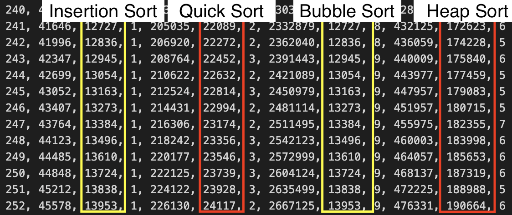

# Instrukser for å kjøre programmet

1. javac *.java

2. java Main.java

3. Deretter ber terminalen deg om å skrive inn navnet til filen + extension, f.eks. input.txt

# Eksperimenter og refleksjoner

Eksperimentet ble utført ved å bruke store og små input filer, både tilfeldige og nesten sorterte.

inputfiler som ble brukt i dette eksperimentet:
- nearly_sorted_1000
- nearly_sorted_10000
- nearly_sorted_100000
- random_1000
- random_10000
- random_100000

## I hvilken grad stemmer kjøretiden overens med kjøretidsanalysene (stor O) for de ulike algoritmene?

Kjøretidene ble satt i excel og deretter et linjediagram for å fremstille kjøretidskompleksiteten. Input som ble tatt i bruk i denne grafen er en tilfeldig sortert liste på størrelsen av 1000:

Quick sort og heap sort har i gjennomsnittet O(n log n), men kan ha noen segmenter der de har ujevne vekst.

Insertion sort og bubble sort har en kjøretid som vokser omtrent som O(n^2), men bubble sort øker betraktelig høyere opp enn insertion sort når n blir større.

## Hvordan er antall sammenligninger og antall bytter korrelert med kjøretiden?

Bubble sort er algoritmen som utførte mest sammenligninger og bytter, dersom listen er usortert og er tilfeldig sortert. På grunn av dette har den lengere kjøretid. Økninger i størrelsen gjør at kjøretiden øker dramatisk, nemlig på grunn av at både sammenligninger og bytter vokser kvadratisk med n. Quick sort har en mer effektiv bruk av sammenlingninger. Quick sort bruker en pivot for å sammenligne elementer for å avgjøre hvilken side de skal på. For hver partisjonering gjør omtrent n sammenlingninger for n elementer, altså at listen deles i to. Quick sort gjør også færre bytter sammenlignet med bubble sort eller insertion sort, hvorav i quick sort bytter man elementer direkte til riktig del av listen under partisjonering, mens med bubble sort så flytter man elementer ett steg av gangen. Dersom en algoritme har flere ueffektive sammenligninger og bytter, øker også kjøretiden, mens hvis man har effektive sammenligninger og bytter, resulteres det til kortere kjøretid.

## Hvilke sorteringsalgoritmer utmerker seg positivt når n er veldig liten? Og når n er veldig stor?

Markeringene viser tiden til algoritmene i mikrosekunder.

Alle algoritmene brukt her utmerket seg positivt når n er veldig liten når det gjelder tiden. Da er alle veldig like. Det var ikke så store forskjeller mellom de, men det ble større forskjeller på tiden mellom algoritmene, ettersom n ble større. Når n er veldig stor, så utmerker både quick sort og heap sort seg, de var veldig raske. Quick sort er raskest mellom algoritmene når inputen var veldig stor og tilfeldig. Dette skyldes på at jeg bruke en fornuftig strategi for pivot, nemlig at jeg brukte median of three. Quick sort skinner når n er stor fordi den bruker divide and conquer, altså at den deler problemet opp. Med Heap sort var det litt jevnere og stabil, og var like ved quick sort. 

Men når det gjelder å bruke en stor og nesten sorterte lister, så er det insertion sort som er den raskeste, mens bubble sort er den tregeste. En grunn til hvorfor jeg kan tenke meg at insertion sort er raskest er at insertion sort ser på ett element om gangen og deretter flytter det bakover hvis det er feil. Når listen er nesten sortert, trenger nesten ingen elementer å flyttes. Nesten ingen sammenligninger og bytter. Bubble sort må fremdeles sjekke hvert nabopar på nytt for å forsikre seg om at alt er på plass. 

## Hvilke sorteringsalgoritmer utmerker seg positivt for de ulike inputfilene?

Markeringene viser antall bytter, med tilfeldig sortert liste.

En ting som jeg ser at quick sort og heap sort utmerker seg best på (mest quick sort), er at de har betydelig mye mindre bytter sammenlignet med bubble sort og insertion sort når jeg brukte tilfeldig sortert liste. Dette stemmer fordi quick sort og heap sort holder seg nærmere O(n log n), mens bubble sort og insertion sort er på O(n^2). Bubble sort må jo bytte hvert nabo-element hver gang rekkefølgen er feil og må boble opp til enden. Med insertion sort må man finne riktig plass for hvert nytt element ved å skyve større elementer ett hakk opp.

Markeringene viser antall bytter, med nesten sortert liste.

Når det gjelder en nesten sortert liste, så er det insertion sort og bubble sort som utmerker seg best. For bubble sort oppdager den rask at ingen bytter er nødvendig og kan stoppe tidlig dersom listen er nesten sortert (enda bedre hvis man har en optimalisert break). Det samme gjelder for insertion, der man nesten ikke trenger forskyvninger. Grunnen til hvorfor quick sort og heap sort ikke har den samme fordelen er jo fordi quick sort må jo fremdeles partisjonere listen og rekursivt gå ned hver del, mens heap sort må bygge heapen og boble ned elementer i strukturen. Med andre ord, må de følge hele prosessen.

## Har du noen overraskende funn å rapportere?

Når jeg kjørte algoritmene med både nesten sortert og tilfeldig inputfil, fant jeg ut at både insertion sort og bubble sort hadde akkurat det samme antall bytter i hver eneste iterasjon av listen.

Markeringene viser at insertion sort og bubble sort har lik antall bytter.